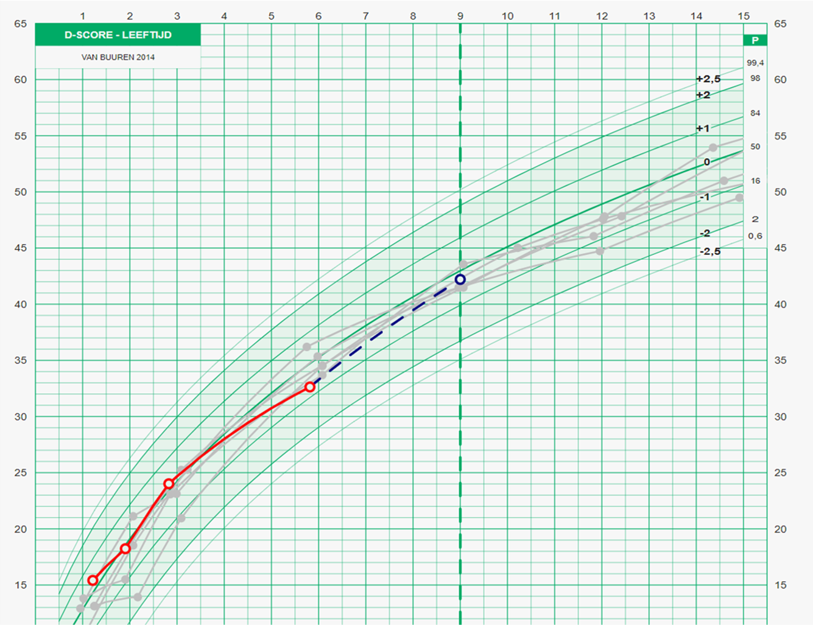

## Predictive distance

<center>   </center>


## Predictive distance
<div class="columns-2">
  <center>   </center>
  Curve matching [@van_buuren_curve_2014]
  
  - Fit linear regression model
  - Predict length at 14 months
  - Select 5 closest matches
</div>

## Other distance measures
$$
\begin{align}
D_M &= ((\vec{x} - \vec{y})' {\rm \bf C}^{-1} (\vec{x} - \vec{y}) )^{\frac{1}{2}},\\
D_F (f, g) &= \inf_{\alpha, \beta} \max_{t\in[0,1]} d(f(\alpha(t)), g(\beta(t))),\\
D_{LSML}(x_i, x_j) &= \sqrt{(x_i - x_j)^TWW^T(x_i - x_j)}.\\
\end{align}
$$ 

## Blending the distances
SMOCK data [@herngreen_growth_1994]
```{r, warning=FALSE, cache=TRUE, echo=FALSE}
library(DT)
library(brokenstick)
datatable(smocc_200, options = list(pageLength = 5))
```

## Blending the distances
We will need the following libraries:
```{r, eval=FALSE}
library(mice)
library(tidyverse)
library(brokenstick)
library(matlib)
library(ggplot2)
library(ggrepel)
library(Rcpp)
library(latex2exp)
library(plotly)
```

## Blending the distances
```{r, eval=FALSE, tidy=TRUE, tidy.opts=list(width.cutoff=40)}
p <- ggplot(donors, aes(x= predictive_distance, y= MD, color = factor(pmm), shape = factor(md), alpha = factor(all)))+
  scale_alpha_discrete(range = c(0.4, 1)) +
  geom_point(color = ifelse(donors$plotname %in% matches_pmm, "red", "black"))+
  geom_point(data=donors %>% filter(plotname %in% matches_blended),
             pch = 21,
             size = 4, 
             colour = "green") +
  geom_label_repel(aes(label = three, segment.size = 0.1), data=donors %>% filter(three %in% matches_three), min.segment.length = 0, label.padding = 0.1, size = 2, max.overlaps = 20, color = "black") +
  labs(x = TeX("Predictive Distance"), 
       y = TeX("Mahalanobis Distance"), 
       title = "Distance of each donor") +
  theme(legend.position = "none")
```

## Blending the distances

```{r, echo=FALSE, message=FALSE, warning=FALSE, results='hide'}
# load packages
library(mice)
library(tidyverse)
library(brokenstick)
library(matlib)
library(ggplot2)
library(ggrepel)
library(Rcpp)
library(latex2exp)
library(plotly)


# select data of the donors (every child except child 10001)
donor_data <- smocc_200 %>% 
  filter(id != "10001")

# select data of the target (child 10001)
target_data <- smocc_200 %>% 
  filter(id == "10001" & age < 0.51)

# fit broken stick model at time level
knots <- round(c(0, 1, 2, 3, 6, 9, 12, 15, 18, 24)/12, 4)
fit <- brokenstick(hgt.z ~ age | id, data = donor_data,
                   knots = knots, boundary = c(0, 3),
                   method = "kr", seed = 15244)

# predict with matching model at child level
covariates <- donor_data %>%
  group_by(id) %>%
  slice(1)
bse <- predict(fit, donor_data, x = "knots", shape = "wide")
donors <- bind_cols(covariates, select(bse, -id))
model <- lm(`1.25` ~ `0` + `0.0833` + `0.1667` + `0.25` + `0.5` + sex + ga + bw, data = donors)
summary(model)

# make predictions
donors_pred <- predict(model)
names(donors_pred) <- donors$id

target <- bind_cols(
  slice(target_data, 1),
  select(predict(fit, target_data, x = "knots", shape = "wide"), -id))
target_pred <- predict(model, newdata = target)

# calculate the predictive distance between subject 10001 (target) and each of the donors
predictive_distance<- as.vector((abs(donors_pred - target_pred)))

# select donor ids
donorids <- donors[ ,1]

# select the values for the first 6 months, for both the donors and the target
donors <- donors[ , c(8:12)]
target <- target[ , c(8:12)]

# calculate the Mahalanobis distance for each of the donors 
MD <- sqrt(mahalanobis(donors, colMeans(donors), cov(donors)))

# add both distances and the ids to the dataframe
donors <- donors %>% 
  add_column(donorids) %>%
  add_column(MD) %>%
  add_column(predictive_distance)

# specify the matches, both in terms of the predictive distance and the blended distance
matches_all<- c("11013", "10093", "11023", "11051", "10006","11063", "11043", "11083", "10002", "10050", "11018")
matches_blended <- c("10093","11063", "11043", "11083", "10002")
matches_pmm <- c("11013", "10093", "11023", "11051", "10006")
matches_md <- c("10093", "10002", "11083", "10050", "11018")
matches_three <- c("10006", "11018")

# make the plot with these matches labelled
donors <- donors %>%
  mutate(plotname = as.character(id))

donors <- donors %>% 
  mutate(blended = ifelse(plotname %in% matches_blended, "yes", "no")) %>%
  mutate(pmm =  ifelse(plotname %in% matches_pmm, "yes", "no")) %>%
  mutate(md = ifelse(plotname %in% matches_md, "yes", "no")) %>%
  mutate(all = ifelse(plotname %in% matches_all, "yes", "no")) %>%
  mutate(three = ifelse(plotname %in% matches_three, plotname, " "))

p <- ggplot(donors, aes(x= predictive_distance, y= MD, color = factor(pmm), shape = factor(md), alpha = factor(all)))+
  scale_alpha_discrete(range = c(0.4, 1)) +
  geom_point(color = ifelse(donors$plotname %in% matches_pmm, "red", "black"))+
  geom_point(data=donors %>% filter(plotname %in% matches_blended),
             pch = 21,
             size = 4, 
             colour = "green") +
  geom_label_repel(aes(label = three, segment.size = 0.1), data=donors %>% filter(three %in% matches_three), min.segment.length = 0, label.padding = 0.1, size = 2, max.overlaps = 20, color = "black") +
  labs(x = TeX("Predictive Distance"), 
       y = TeX("Mahalanobis Distance"), 
       title = "Distance of each donor") +
  theme(legend.position = "none")

```

```{r, echo=FALSE, warning=FALSE}
ggplotly(p)
```

## References


